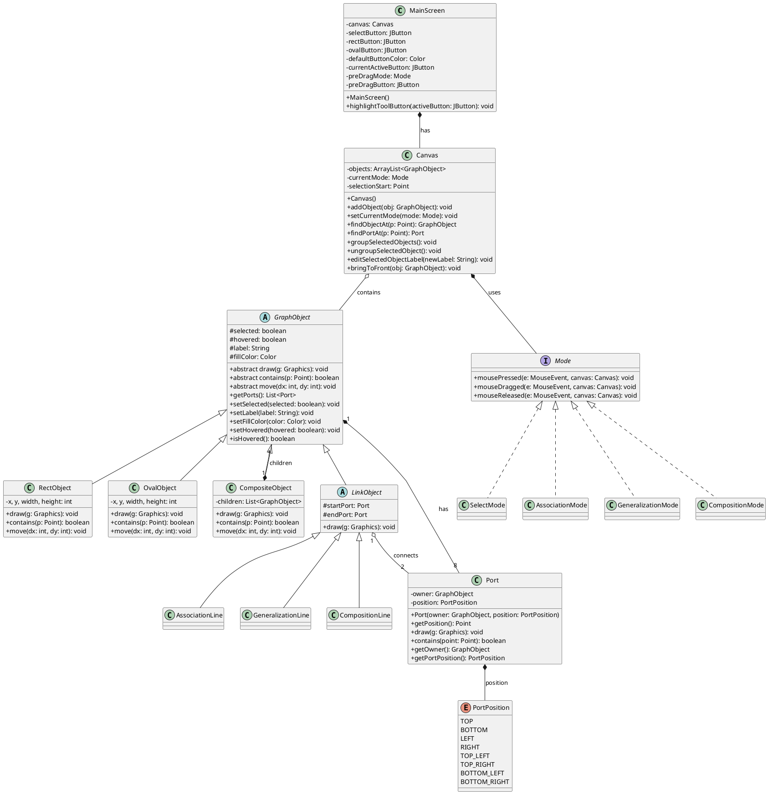

# 物件導向期末 Project 分析作業

## 第一題：Class Diagram with methods and key attributes

請將以下 PlantUML 語法複製到 [PlantUML 線上編輯器](https://www.plantuml.com/plantuml/uml/) 產生類別圖，並截圖貼入作業中。



---

## 第二題：每個 methods 的概略行為為何 (請參考影片)

### (一) 從 Use Case 轉換至 Pseudo Code 的推導過程

**UseCase 1: Creating a basic shape (以 Rect 為例)**
```text
Kevin press mouse button on Rect button
startToolbarDrag("RECT")
Kevin drag the mouse to canvas at (x1, y1)
Kevin release mouse button at (x1, y1)
finishToolbarDrag(x1, y1)
if (x1, y1) is in canvas
    create a RectObject at (x1, y1)
    add RectObject to canvas
    repaint canvas
```

**UseCase 2: Selecting an object**
```text
Kevin click Select button
in canvas, kevin press mouse button at (x1, y1)
mousePressed(x1, y1)
clear selection of all objects
if (x1, y1) is located at object o1
    set o1 selected state to true
repaint canvas
```

**UseCase 3: Creating an UML connection line (同老師範例)**
```text
Kevin click assoc line button
in canvas, kevin press mouse button at (x1, y1)
mousePressed(x1, y1)
if (x1, y1) is located at object o1, save o1 port p1
in canvas, kevin drag the mouse to (x2, y2)
mouseReleased(x2, y2)
if (x2, y2) is located at object o2, save o2 port p2
if (o1 and o2 are basic objects)
    create an AssociationLine from p1 to p2
    add AssociationLine to canvas
    repaint canvas
```

**UseCase 4: Grouping objects**
```text
Kevin click Group menu item
groupSelectedObjects()
get all selected objects in canvas
if number of selected objects >= 2
    create a CompositeObject containing these selected objects
    set these selected objects state to unselected
    remove these selected objects from canvas
    add the new CompositeObject to canvas
    set CompositeObject state to selected
    repaint canvas
```

### (二) 每個 Methods 的概略行為 (Distribute into classes)

經過上述 Pseudo Code 推導，我們將行為分配至各個類別中，整理出以下關鍵 Methods：

#### 1. `Canvas` (畫布管理器)
*   **`addObject(GraphObject obj)`**: 將產生的形狀或線條加入到畫布維護的 `objects` 清單中，並觸發重繪 (repaint)。
*   **`setCurrentMode(Mode mode)`**: 當使用者點擊左側工具列時，切換目前的滑鼠互動模式（例如換成 `SelectMode` 或 `AssociationMode`）。
*   **`findObjectAt(Point p)`**: 當滑鼠點擊時，從後往前遍歷 `objects` 清單，找出滑鼠點擊座標 `p` 落在的圖形物件並回傳。
*   **`groupSelectedObjects()`**: 將目前畫布上被選取的實體圖形取出，將它們包裝成一個新的 `CompositeObject`（群組物件）後放回畫布，並刪除原有的散落圖形。
*   **`ungroupSelectedObject()`**: 檢查目前單獨選取的物件是否為 `CompositeObject`，若是，則解除群組，將其內部的子物件重新倒出來放回畫布。

#### 2. `GraphObject` (圖形基礎類別)
*   **`draw(Graphics g)`**: 各個子類別（如 Rect, Oval）各自實作的繪圖邏輯，包含畫出外框、填滿顏色、寫上 Label、以及被選取時要畫出端點 (Ports)。
*   **`contains(Point p)`**: 判斷滑鼠游標的位置 `p` 是否落在該圖形的邊界範圍內。
*   **`move(int dx, int dy)`**: 根據傳入的 X 與 Y 位移量，更新圖形的座標位置。

#### 3. `Mode` 介面及其子類別 (State Pattern 狀態模式)
*   **`mousePressed/Dragged/Released(...)`**: 將滑鼠事件的邏輯從 `Canvas` 抽離出來，讓不同模式各自處理。例如 `SelectMode` 會在點擊時處理選取、拖曳時處理移動；而連線模式則會判斷起點和終點是否落在 `Port` 上。

---

## 第三題：UML Editor 每一個 Use Case 的 Sequence Diagram

請前往 [WebSequenceDiagrams](https://www.websequencediagrams.com/app) ，在左側的文字框內分別貼上以下語法並截圖，就能產生符合標準的循序圖：

### Use Case 1: Create Object (新增基礎圖形)
```text
title Use Case: Create Shape (Rect/Oval)

User->MainScreen: Drag Shape Button to Canvas
MainScreen->Canvas: startToolbarDrag("RECT")
User->MainScreen: Release mouse on Canvas
MainScreen->Canvas: finishToolbarDrag(canvasPoint)
Canvas->RectObject: new RectObject(x, y, w, h)
Canvas->Canvas: addObject(rect)
Canvas->Canvas: repaint()
```

### Use Case 2: Select Object (選取單一圖形)
```text
title Use Case: Select Object

User->Canvas: mousePressed(on an object)
Canvas->SelectMode: mousePressed(e, canvas)
SelectMode->Canvas: clearSelection()
SelectMode->Canvas: findObjectAt(p)
Canvas-->SelectMode: return targetObject
SelectMode->GraphObject: setSelected(true)
Canvas->Canvas: repaint()
```

### Use Case 3: Group Objects (群組物件)
```text
title Use Case: Group Objects

User->MainScreen: Click "Edit -> Group"
MainScreen->Canvas: groupSelectedObjects()
Canvas->Canvas: getSelectedObjects()
Canvas-->Canvas: return selectedObjects
Canvas->CompositeObject: new CompositeObject(selectedObjects)
CompositeObject->GraphObject: setSelected(false)
Canvas->Canvas: removeAll(selectedObjects)
Canvas->Canvas: objects.add(compositeGroup)
Canvas->Canvas: repaint()
```

### Use Case 4: Draw Connection Line (畫連接線)
```text
title Use Case: Draw Connection Line

User->MainScreen: Click "Association" Button
MainScreen->Canvas: setCurrentMode(new AssociationMode())
User->Canvas: mousePressed(on Port 1)
Canvas->AssociationMode: mousePressed(e, canvas)
AssociationMode->Canvas: findPortAt(p)
Canvas-->AssociationMode: return startPort
User->Canvas: Drag and Release on Port 2
Canvas->AssociationMode: mouseReleased(e, canvas)
AssociationMode->Canvas: findPortAt(p)
Canvas-->AssociationMode: return endPort
AssociationMode->AssociationLine: new AssociationLine(startPort, endPort)
AssociationMode->Canvas: addObject(line)
Canvas->Canvas: repaint()
```

### Use Case 5: Edit Label (修改名稱與顏色)
```text
title Use Case: Edit Label and Color

User->MainScreen: Click "Edit -> Label"
MainScreen->Canvas: getSingleSelectedObject()
Canvas-->MainScreen: return selectedObject
MainScreen->User: show JColorChooser & JTextField
User->MainScreen: Input Name & Select Color, Click OK
MainScreen->GraphObject: setLabel(newName)
MainScreen->GraphObject: setFillColor(newColor)
MainScreen->Canvas: repaint()
```
